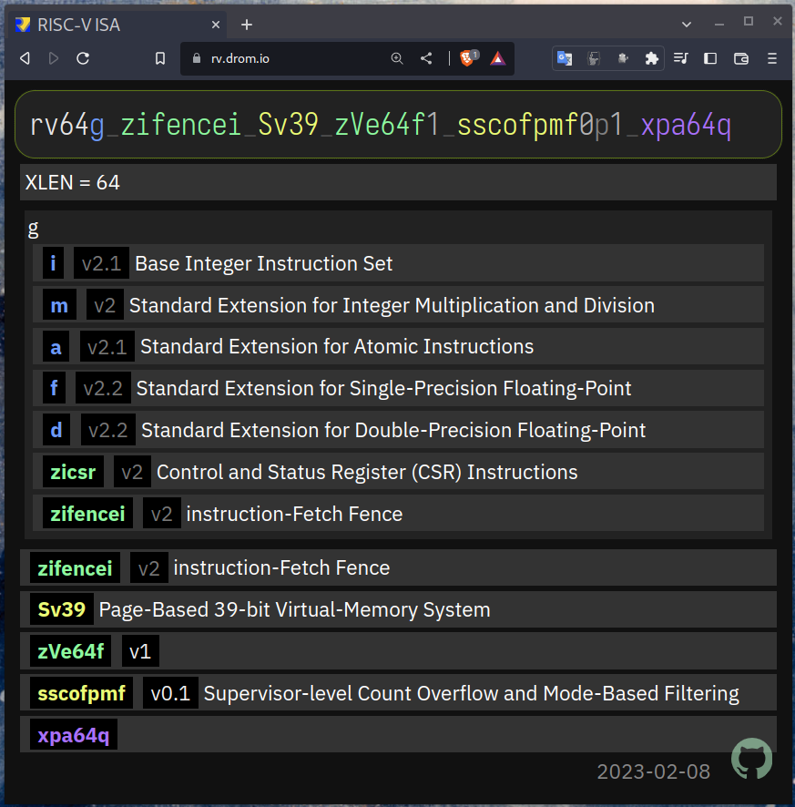

[](https://github.com/drom/rv/actions/workflows/linux.yml)

## RISC-V ISA online string decoder

https://rv.drom.io



## Test & Build

```
npm i
npm test
npm run build
./node_modules/.bin/live-server docs &
```

## License
Apache 2.0 [LICENSE](https://github.com/drom/rv/blob/master/LICENSE).
